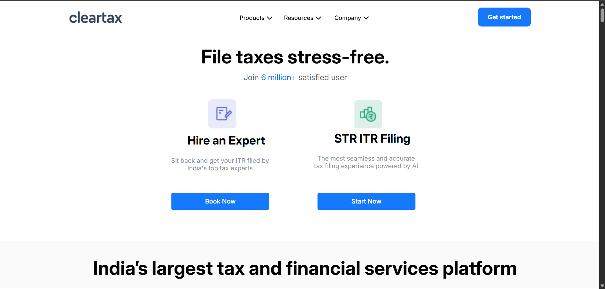

# 💼 ClearTax Website Clone

A **responsive, static clone** of the ClearTax homepage built with pure **HTML5 + CSS3**—no JavaScript, no backend.

## ✨ Highlights

- 🎨 Pixel-perfect layout of the original site

- 📱 Fully responsive (desktop, tablet, mobile) via Flexbox + Media Queries
  
- 🧭 Clean navigation bar with icon hover effects
 
- ⚡ Lightweight: fast load, zero external libs

## 🛠️ Stack

- HTML5 (semantic markup)  
- CSS3 (Flexbox, Grid, variables, transitions)

- Media Queries for breakpoints

## 🖼️ Screenshots  

## Desktop View

## Mobile View

## 🚀 Quick Start

git clone https://github.com/abhisarkar08/cleartax-clone.git

cd cleartax-clone

open index.html # or just double-click

> Design inspired by the original [ClearTax](https://cleartax.in) site. This project focuses solely on front-end layout and responsiveness.
